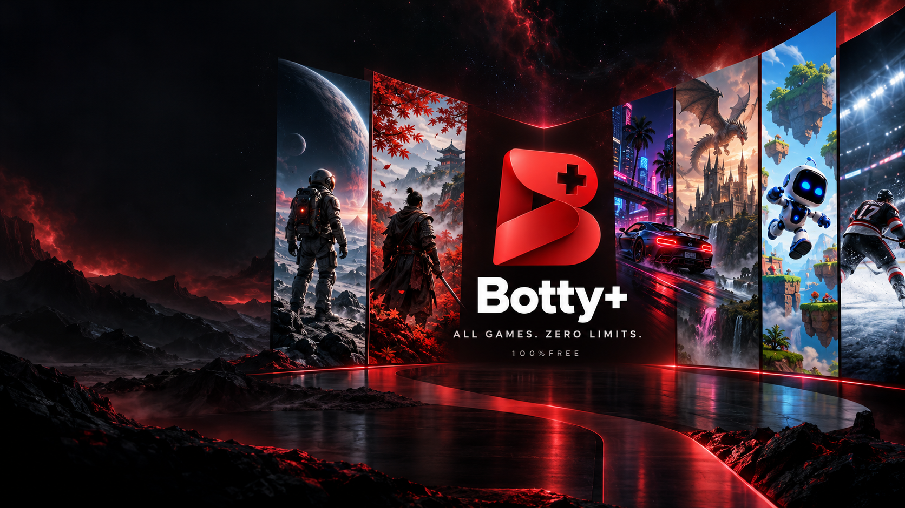
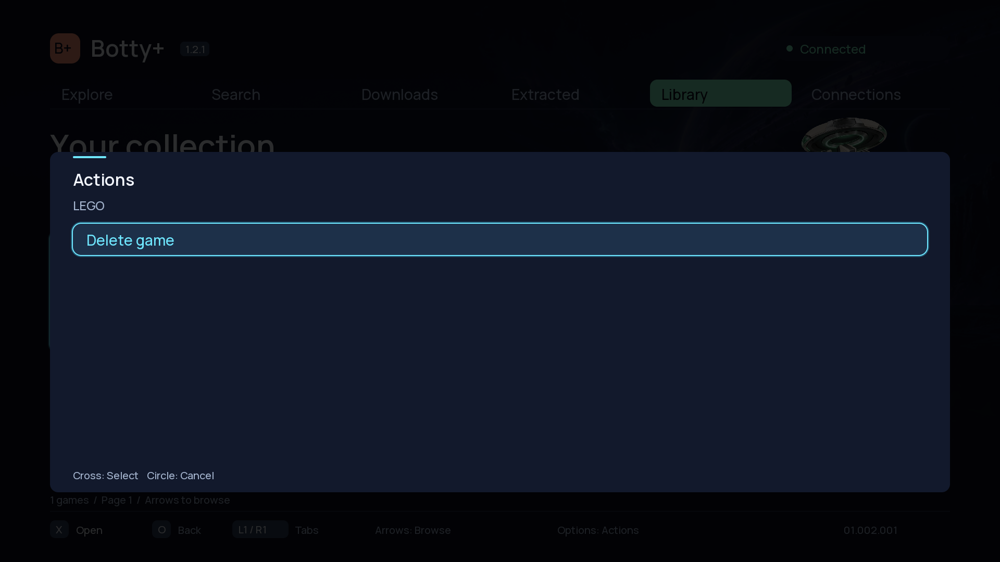
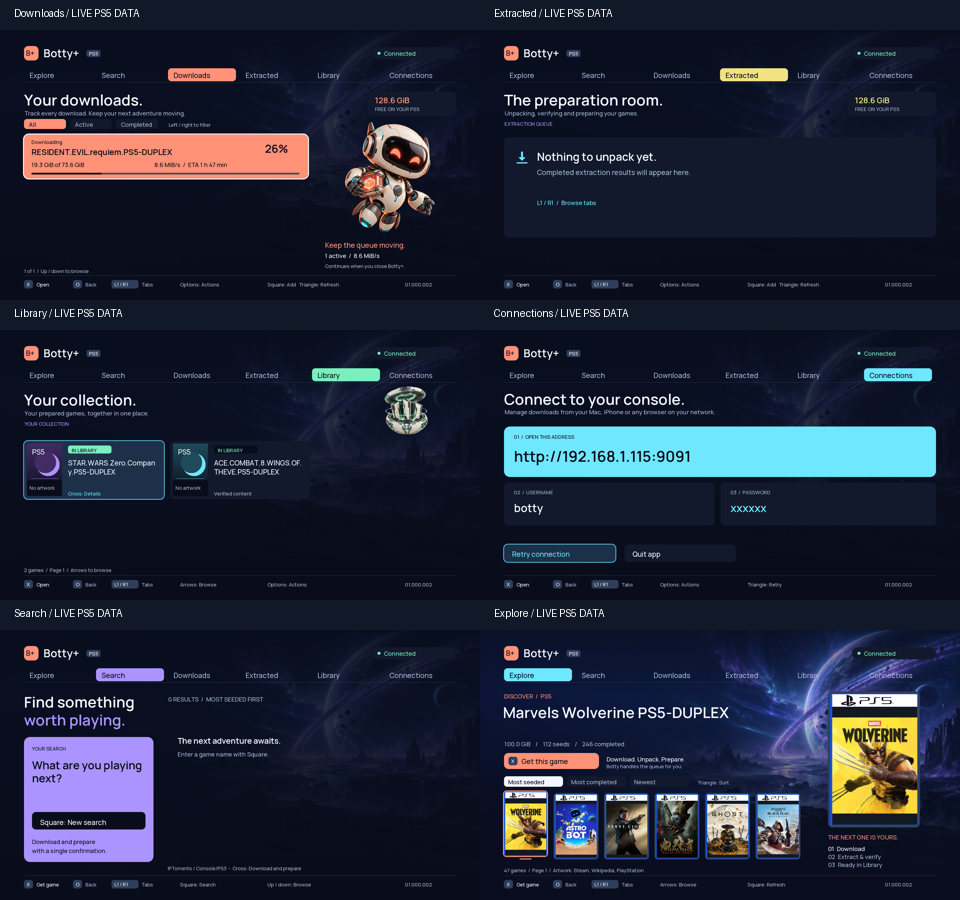
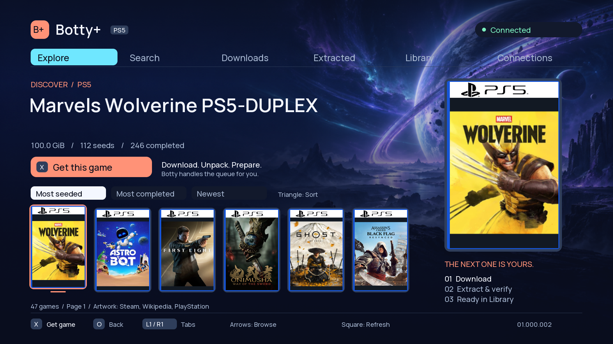
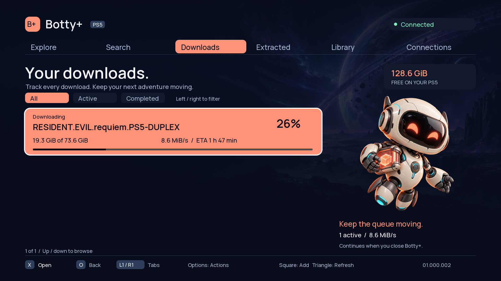
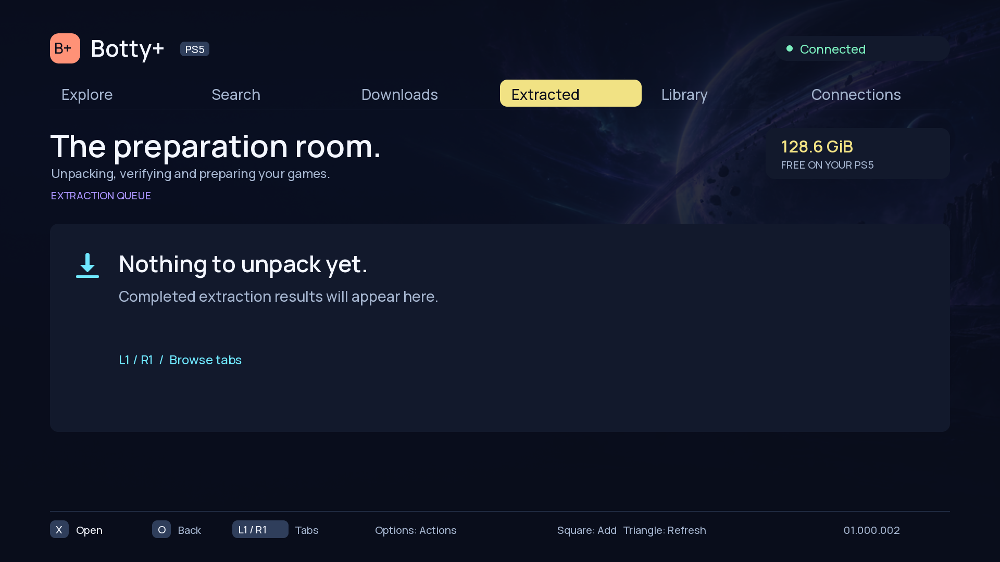
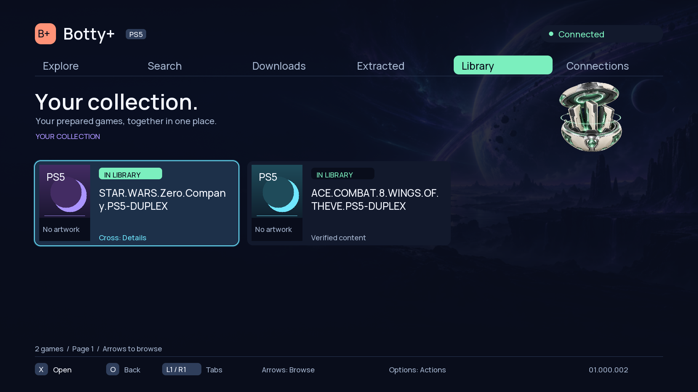
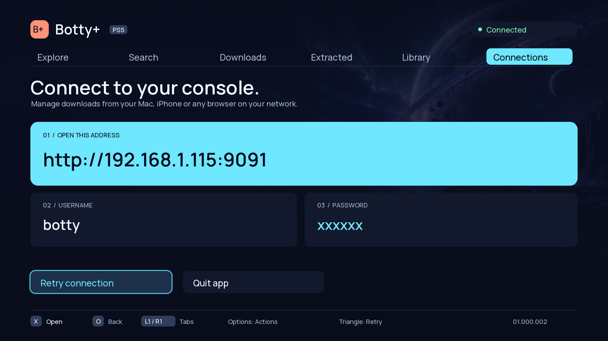
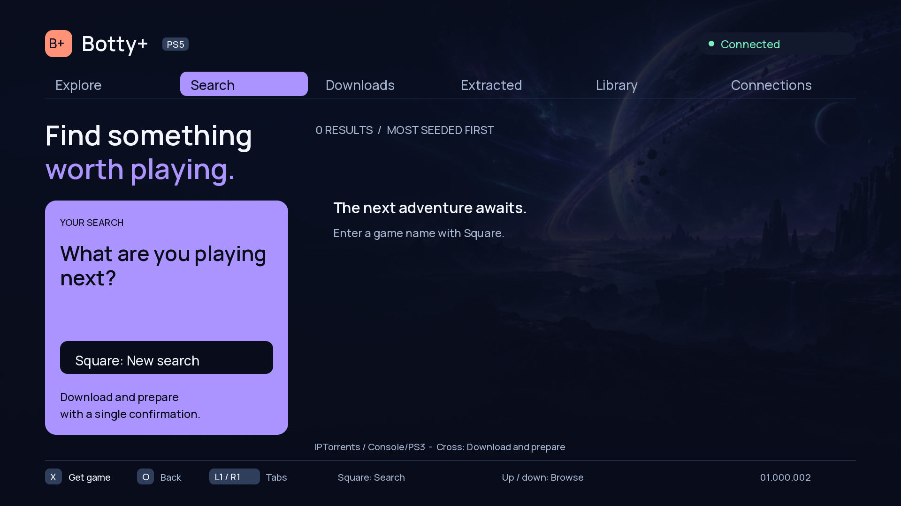

<p align="center">
  
</p>

<h1 align="center">Botty+ 1.2.2</h1>

<p align="center">Your downloads. Your library. On PS5.</p>

<p align="center">
  <a href="https://github.com/Portablelle/botty-ps5/releases/latest">Download the latest release</a> ·
  <a href="deployment/README.md">Deployment guide</a> ·
  <a href="homebrew/botty-native/VALIDATION.md">Compatibility &amp; validation</a>
</p>



Botty+ is a native, controller-driven download and library manager for PS5 homebrew. It combines a browser launch portal, a background rTorrent daemon, a RAR extraction service and a 1080p native application.

Open your hosted portal on the PS5, select **LAUNCH**, then open **Botty+** from the home screen when setup completes. Downloads and extraction run in background services; the native app is their interface.

**Native app 1.2.1:** service **1.2.2**, native title **01.002.001** (`PPSA99071`),
rTorrent **0.16.24-botty2** and ShadowMountPlus **1.7beta3-botty.3**. Library can
create a compressed PS5 folder-game image, verify all files through the PS5 mount,
retain or restore the original, and delete the uncompressed backup after an
explicit confirmation and a second verification. LEGO Voyagers launched from its
compressed copy on firmware **13.00**. Other titles and firmware combinations
require their own runtime acceptance. APR games require an existing index.

Service 1.2.2 cleans a tracked failed compression's temporary image and hash file
when **Compress game** is selected again. It checks that the worker is idle and
the original folder still matches, frees the temporary space, then starts from
zero. Interrupted compression cannot resume; completed images and recovery
backups are preserved.

Close Botty+ when prompted to finish mounting, verification or original deletion.
The background service continues the operation. Saves and download archives are
preserved. See [Library compression](homebrew/game-compressor/README.md).

Existing Transmission downloads require a one-time migration with both engines
stopped and a full piece rehash; the portal refuses to start rTorrent over an
active or unmigrated Transmission installation. See [migration notes](homebrew/rtorrent/README.md).
The Relapse browser chain includes firmware offsets from **7.00 to 13.60**;
this is not a compatibility guarantee for the complete stack. See the
[validation record](homebrew/botty-native/VALIDATION.md) for remaining limits.

## Library compression

The new actions retain the original until deletion is explicitly confirmed.
This image is a host rendering of the actual native UI with a representative fixture.



## Screenshots

These screenshots use a read-only snapshot from a live Botty+ session. They show real PS5 download, library, search and Explore data at capture time; the Connections password is masked.



The Explore screen resolves real game artwork from the configured catalog:



<details>
<summary>Open the individual Botty+ pages</summary>












</details>

The launch portal shown before opening Botty+:


## Features

- **Explore and Search:** optional Prowlarr integration, cover artwork and a persistent download → extract → library workflow.
- **Downloads:** progress, speeds, ETA, peer counts, magnet input, pause, resume and verification.
- **Extracted:** multivolume RAR extraction, CRC checks, optional passwords, progress, cancellation and cleanup.
- **Library:** publish recognized PS5 app folders or exFAT images into `/data/homebrew`, with permissions prepared for the native sandbox.
- **Connections:** display the console's Botty web URL and credentials for another device on the same LAN.

Normal extraction and library publication retain the original torrent archives for seeding. The separate **Remove torrent and files** action explicitly deletes download data after confirmation. ZIP/7z extraction, PKG installation and automatic game launching are not implemented.

## Start here

| Task | Guide |
| --- | --- |
| Host the portal with HTTPS | [Deployment](deployment/README.md#host-the-portal) |
| Change PS5 DNS and open the User's Guide | [DNS and User's Guide walkthrough](#open-the-portal-through-the-users-guide) |
| Install and start on the PS5 | [Console setup](#console-setup) |
| Configure Search, Explore and covers | [Optional services](deployment/README.md#optional-search-and-explore) |
| Build, test and package a release | [Development](docs/DEVELOPMENT.md) |
| Update or roll back an installation | [Updates and rollback](deployment/README.md#updates-and-rollback) |

## Requirements

- A PS5 supported by the bundled Relapse chain, connected to a trusted LAN, and a way to open your portal in its browser.
- An HTTPS origin trusted by the PS5 browser. Package verification uses Web Crypto; ordinary HTTP on a LAN IP is insufficient for installation.
- Enough console storage for both original downloads and extracted output. Preflight reserves an additional 512 MiB but cannot reserve space against other applications.
- For hosting: Git, Python 3.10+ and a static web server. The Ubuntu/Nginx example also uses a domain name and a TLS certificate. Node.js 20+ runs the portal tests; Docker is needed only to rebuild PS5 binaries.
- Optional: Prowlarr for Search/Explore and Python with Pillow for the cover resolver. These are not required for manual magnets and extraction.

Use the stack only on consoles and content you are authorized to manage. Keep console services on the trusted LAN; no router port forwarding is needed.

## Download 1.01

Get the ready-to-host portal and native application from the [latest release](https://github.com/Portablelle/botty-ps5/releases/latest). Release assets include SHA-256 checksums and corresponding source archives. The portal bundle is the complete installation path; the native ZIP alone still needs the Botty and rTorrent services.

## Get the repository

```sh
git clone --recurse-submodules https://github.com/Portablelle/botty-ps5.git
cd botty-ps5
python3 scripts/portal-manifest.py --check
node --test tests/*.test.mjs
```

For an existing clone, run `git submodule update --init --recursive`. The submodule preserves the pinned upstream Relapse checkout; `vps-site/` is the customized portal and already contains its browser code and deployable packages. No npm install or JavaScript bundler is required.

Export a verified, self-contained site:

```sh
python3 scripts/portal-manifest.py --output dist/portal
```

Deploy **the contents of `dist/portal/`**, using the [HTTPS deployment walkthrough](deployment/README.md). The exporter excludes local backups, previous package versions, credentials and development files. Do not expose the repository root as a web directory.

For a desktop visual preview only:

```sh
python3 vps-site/serve.py --bind 127.0.0.1 --port 8000
```

Open `http://127.0.0.1:8000`. Launch is disabled outside a supported PS5 browser. This preview does not test the exploit or console installation.

## Open the portal through the User's Guide

The User's Guide can open Botty+ when a dedicated DNS resolver redirects the
Guide hostname to your portal. First deploy the HTTPS site and the
[DNS/Guide redirect services](deployment/README.md#optional-users-guide-dns),
or obtain the resolver's IP address and expected portal URL from your host
administrator. Hosting the static site alone does not enable this entry point.

`DNS_IP` below means the reachable IPv4 address of that configured resolver.
Enter its numeric address on the console, not `DNS_IP`, a URL, or the sample
`203.0.113.10` from the configuration files. The repository does not provide a
public DNS service. A VPS resolver must allow your home connection's public IP
through its DNS firewall rules.

### 1. Change DNS on the PS5

1. Record your current DNS settings so you can restore them later.
2. From the home screen, open **Settings → Network → Settings → Set Up Internet Connection**.
3. Highlight your connected Wi-Fi network or wired LAN connection, press
   **Options**, then select **Advanced Settings**.
4. Change **DNS Settings** to **Manual** and enter:

   | Setting | Value |
   | --- | --- |
   | Primary DNS | `DNS_IP` |
   | Secondary DNS | The same `DNS_IP`, or a second resolver with identical Guide redirects |

5. Keep your existing IP address, DHCP, MTU and proxy settings. Select **OK** to
   save and reconnect. Apply this to the connection you actually use; switching
   between Wi-Fi and Ethernet may use a different saved configuration.

Do not use Google, Cloudflare or your normal router DNS as the secondary for
this setup: it can resolve the original Guide instead of the Botty+ redirect.
The bundled resolver also blocks PlayStation service domains, so PSN sign-in or
the console's Internet test may fail even when the portal is reachable.

### 2. Open the Guide and launch Botty+

1. After a cold restart, open **Settings → User's Guide, Health and Safety, and
   Other Information → User's Guide**. On versions with the **Guide & Tips**
   menu label, open that section, then **Guide and Tips → User's Guide**.
2. The Guide should redirect to your configured **HTTPS Botty+ portal**. Check
   that the destination is the portal URL supplied by your host administrator.
   The sample redirect uses a self-signed certificate for the Guide hostname;
   a warning may appear at that hop. Continue only for your expected configured
   redirect if the browser offers that option. The destination portal needs a
   trusted certificate. If the browser refuses the hop, this route cannot be
   used on that setup; see the troubleshooting table below.
3. Select **LAUNCH** once and leave the page open until it shows **READY**.
4. Press **PS**, return to the home screen and open **Botty+**. Allow time for
   the icon to appear on first installation. Repeat the Guide → **LAUNCH**
   sequence after each cold boot, before opening the native app.

The DNS redirect route still needs hardware acceptance on each intended setup;
tested native navigation does not validate the Guide's certificate behavior.
For the console menu references, see PlayStation's
[network settings](https://www.playstation.com/en-us/support/connectivity/internet-connect-playstation/)
and [User's Guide instructions](https://www.playstation.com/en-us/support/hardware/ps5-console-users-guide/).

### If the Guide does not open the portal

| Symptom | What to check |
| --- | --- |
| The original PlayStation guide appears | Recheck DNS on the active connection and both DNS fields. Close the Guide and reconnect after saving. |
| DNS error or timeout | Check that the resolver is running and reachable, and that its firewall permits your current client address on UDP and TCP 53. |
| Certificate warning or refusal | Verify the Guide redirect configuration and the target portal's certificate. A refused Guide hop requires another working browser entry point. |
| Redirect works but the portal will not load | Check the redirect URL, portal DNS record, HTTPS certificate and web server. |
| LAUNCH is disabled | Check the firmware support message on the portal; DNS settings do not add firmware compatibility. |

To undo the change, return to the same connection's **Advanced Settings** and
restore your previous DNS configuration (**Automatic** if that was the original
setting). This also removes the Guide redirect for that connection.

## Console setup

1. Host the complete exported portal over HTTPS. After a cold restart, open it using the [DNS and User's Guide walkthrough](#open-the-portal-through-the-users-guide), or another working browser entry point for its HTTPS URL.
2. Select **LAUNCH** once and leave the page open. The portal runs Relapse, verifies or installs the native title, loads Kstuff and ShadowMountPlus, starts FTP, then prepares rTorrent and Botty.
3. Wait for **READY**, press PS and open **Botty+**. ShadowMountPlus discovery is asynchronous; a successful payload transfer alone does not prove home-screen registration.
4. Open **Connections** to use Botty from a computer or phone. Use the displayed URL, username `botty` and console-generated password. No credentials are bundled in this repository.
5. Add a small test magnet or an authorized test download, then validate extraction and library publication before using large files.

After another cold boot, repeat the portal launch before opening Botty+. Existing matching package files and running services are reused. An older recognized Botty+ installation is backed up and updated automatically with the app closed. A damaged recognized installation can be repaired; foreign titles and downgrades are refused. See [updates and rollback](deployment/README.md#updates-and-rollback).

The Botty web interface permits localhost and authenticated `192.168.*.*` clients. A client on `10.*` or `172.16.*` requires a deliberate change in the service's LAN access and connection-discovery logic before rebuilding; do not disable authentication to work around a 403. LAN HTTP is unencrypted. Passwords are currently six generated alphanumeric characters, with migration support for older credentials.

## Native controls

| Control | Action |
| --- | --- |
| L1 / R1 | Switch Explore, Search, Downloads, Extracted, Library, Connections |
| D-pad / stick | Navigate items, pages and the Library grid |
| Cross / Circle | Open or confirm / go back |
| Options | Actions for the selected item |
| Square | Context action: refresh Explore, enter a search or add a magnet |
| Triangle | Cycle Explore ranking or refresh other screens |

The in-app keyboard supports controller input and Unicode code-point entry. Destructive actions use a separate confirmation with Cancel selected initially. See the [native application guide](homebrew/botty-native/README.md) for details.

## Storage and ports

| Location | Contents |
| --- | --- |
| `/data/homebrew/PPSA99071` | Botty+ native application |
| `/data/botty/manager/1.1.0` | Botty service, local web assets and CA bundle |
| `/data/botty/rtorrent/state` | rTorrent session, credentials and original torrent metadata |
| `/data/botty/downloads/incomplete`, `complete` | Original downloads |
| `/data/botty/extracted`, `jobs`, `automatic` | Extraction output, job records and automatic queue |
| `/data/botty/prowlarr.json` | Optional private Search/Explore configuration |
| `/data/homebrew` | Published library content |

| Port | Purpose | Exposure |
| --- | --- | --- |
| 443 | Hosted portal and optional authenticated proxy routes | Hosting server |
| 8088 | Botty API / legacy web UI | PS5 loopback only |
| 5001 | rTorrent SCGI JSON-RPC | Console loopback only |
| 2121 | FTP payload | PS5 LAN |
| 9021 | ELF loader | PS5 LAN |
| 8080 | Temporary websrv launcher | PS5 LAN, stopped after daemon startup |
| 9696 / 9697 | Prowlarr / artwork resolver | Hosting server loopback |

The VPS serves software and optional search/artwork requests. Torrent data downloads directly to the PS5. Do not delete `/data/botty` to uninstall or update the native title: it contains persistent user data.

## Troubleshooting

| Symptom | Next step |
| --- | --- |
| Launch disabled on desktop | Expected; use a supported PS5 browser. |
| HTTPS / Web Crypto error | Open the trusted HTTPS URL directly; check certificate and console clock. |
| STOPPED, browser hang or kernel panic | Read the session log and restart the PS5 before another attempt. |
| Package hash mismatch | Re-export a coherent release; disable CDN rewriting and stale caches. |
| Update requires a closed app | Close Botty+ and other native apps, then start a new console session. |
| Service update pending | The new service is staged; let current work finish before the next console restart. |
| Update interrupted | Restart the portal session to recover from its journal; retain the backup directory. |
| READY but no icon | Allow discovery time and check ShadowMountPlus registration; another session may be needed. |
| Botty web 403 | Check the LAN allowlist and displayed address; preserve saved credentials. |
| Search/Explore unavailable | Check private Prowlarr config, API key, indexer IDs/category and CA path. Manual magnets remain available. |
| Interrupted extraction | Inspect the job, clean its partial output through Botty, then retry with the original archives. |

Keep the console awake during downloads and extraction. Rest mode, long-duration downloads and simultaneous gameplay remain unvalidated. Never restart the service merely to deploy an update while an extraction is active.

## Repository map

- `vps-site/`: static launch portal and verified installable packages.
- `homebrew/botty/`: C++17 service, extraction engine and legacy local web UI.
- `homebrew/botty-native/`: C++20 native title, assets, build tools and tests.
- `deployment/`: generic Nginx, DNS, systemd and artwork examples.
- `scripts/`, `tests/`: packaging, export verification and installer contracts.
- `Relapse-Exploit/`: pinned upstream submodule.
- `payloads/`: payloads for manual use, with versions and hashes; the modified
  ShadowMountPlus build has a [pinned source recipe](homebrew/shadowmountplus/README.md).

## Credits and licenses

Relapse credits Sonic_Iso, Jordy, ntfargo, ufm42, Dr. Yenyen and the contributors listed in [the portal README](vps-site/README.md). Botty also uses work from the PS5 payload SDK, native app boilerplate, Transmission, UnRAR, cpp-httplib, nlohmann/json and Manrope projects.

Licenses are component-specific. See [third-party notices](THIRD_PARTY.md), [service license](homebrew/botty/LICENSE), [native license](homebrew/botty-native/LICENSE), [portal license](vps-site/LICENSE) and the vendored notices. Keep those files and corresponding source with redistributions. Botty+ is an independent homebrew project and is not affiliated with Sony Interactive Entertainment.
