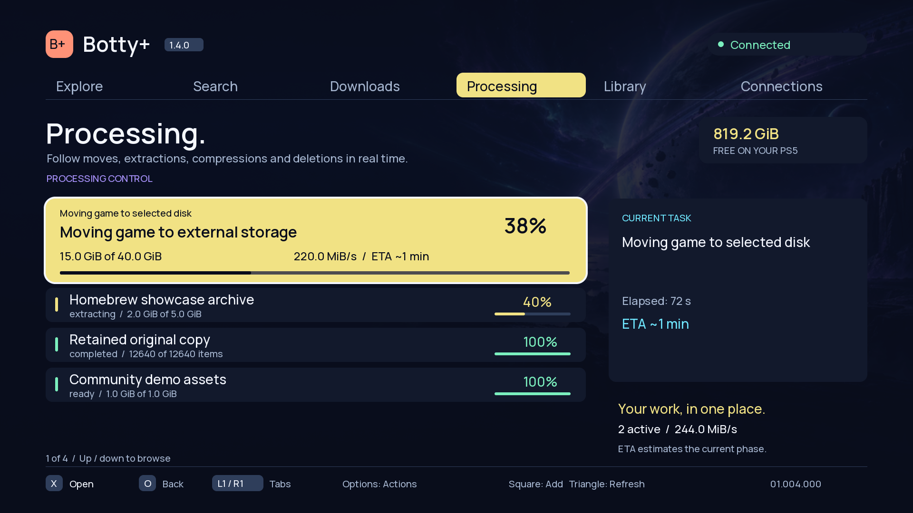
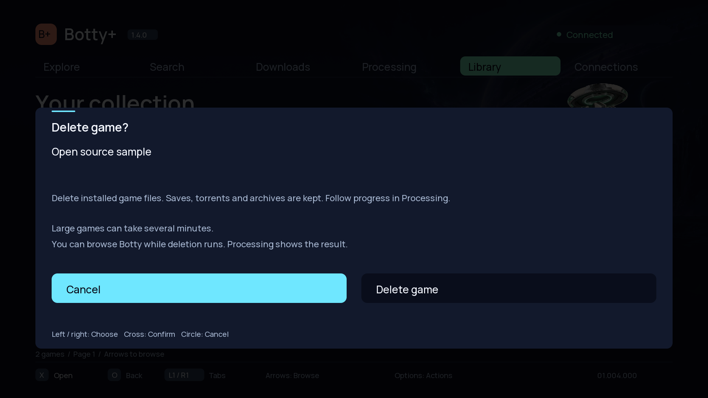

# Botty+ 1.4.0

Botty+ can now stay open during supported Library moves and deletions. Processing
shows live progress, completion and failures, removing the need to repeatedly
try reopening the app to discover whether an operation has finished.

## Changes

- Run Library deletion asynchronously so the controller and catalog remain responsive.
- Follow moves, deletions and retained-original cleanup in Processing and in the web interface, with phase, progress and available speed/ETA information.
- Show request acceptance separately from completion; retain failed and uncertain operations without automatically repeating a destructive request.
- Bundle ShadowMountPlus 1.7beta4-botty.2 with guarded storage operations while Botty+ is the positively identified active app. Lifecycle transitions, other active titles and conflicting mounts continue to block file mutations.
- Rebase nested image paths after a move and update cached locations without requiring a general scan during the active Botty+ session.
- Keep originals until a move has passed its write/flush and inventory/size checks. A full byte comparison remains optional and is never claimed when skipped.
- Keep saves, source torrents and archives when deleting Library game files.

New-title registration, compressed-copy activation/restoration and unsupported
storage operations retain their existing session requirements. Home-screen tile
updates may therefore occur after Botty+ closes.

## Versions

| Component | Version |
| --- | --- |
| Portal | 1.4.0 |
| Botty+ native title | 01.004.000 |
| Botty service | 1.4.0 |
| ShadowMountPlus | 1.7beta4-botty.2 |
| rTorrent | 0.16.24-botty3 (unchanged) |
| CheatRunner | 0.17.2-botty.1 (unchanged) |
| Kstuff Lite | v1.11 (unchanged) |

## Update

Use **botty-portal-1.4.0.tar.gz** for the complete Portal and packages. Let all
extractions, compressions, moves and deletions finish, then use the normal console
restart and Portal **LAUNCH** workflow to load the matching service, native app
and ShadowMount. Updating the hosted portal alone does not replace processes
already running on the console.

The release includes the native app, service and companion packages, complete
corresponding source archives and notices, and **SHA256SUMS**. Previous portal
releases can be retained for rollback.

## Validation

- Service core, HTTP, storage, compression and background-operation regressions passed, including cancellation, source preservation, disk loss, worker failure and uncertain status without replay.
- Native model, package and real-service client integration tests passed. Renderer previews were inspected.
- ShadowMount production-code tests passed for TitleDir handling, the storage policy, cross-volume copies and nested-image path rebasing.
- Native, service and ShadowMount PS5 cross-builds passed.
- Portal/installer tests, source/export tests, installer pins and all 123 public-file hashes passed.

**Console acceptance of the new background move/delete behavior remains pending.**
These checks do not claim that release 1.4.0 has been installed or tested on a PS5.

