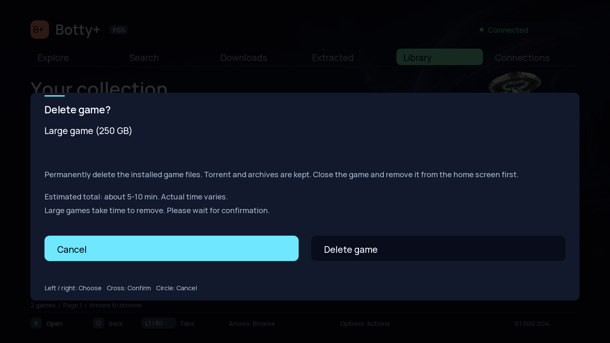
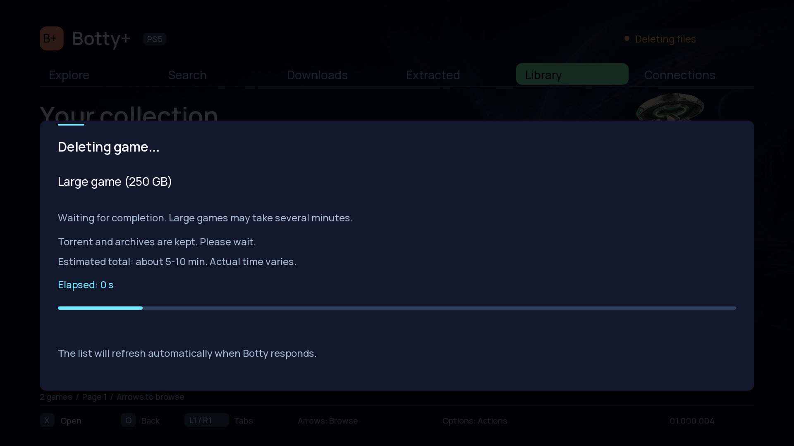

# Botty+ 1.07

Large game deletions now remain on the normal **Deleting game...** screen while the app waits for confirmation. The two-minute warning is removed: elapsed time alone never produces an error or invites a duplicate deletion. Once a fresh, complete catalog confirms that the item is gone, the app reports success even if the original HTTP response timed out. Explicit service errors still appear normally.

Before confirmation and during deletion, the app shows a rough total-duration estimate based on the recorded file size. The planning range extrapolates from the recent approximately 250 GB Ace Combat deletion: allow around 5–10 minutes at that size, or around 2–4 minutes for 100 GB. This is an indicative range based on one console, not a measured live progress percentage, deadline or guaranteed throughput. Storage, file count and concurrent activity can change the actual duration. Unknown sizes show a general large-game notice.

## Components

- Portal release: v1.07.
- Native title: 01.000.004.
- Botty service: 1.0.4, including the v1.06 PS5 syscall crash fix.
- Transmission: 4.0.6, persistent 32 MiB cache default.

## Validation

- Native model, packaging and HTTP action integration tests pass.
- A simulated response delay beyond two minutes retains the pending deletion and blocks duplicate requests. A fresh catalog confirming removal produces success.
- Size estimates and the unknown-size fallback are covered by native tests.
- Native PS5 cross-build and host renderer previews pass.
- Portal package hashes and installer pins verified; 107 Node tests and 8 Python tests pass.
- The earlier real Ace Combat deletion completed with service 1.0.4: installed folder and Library record both absent, state API responding normally. No new real-game deletion is required for this UI update.
- Existing native hardware-validation flags remain unchanged.

## Screenshots

Host previews of the actual renderer using a synthetic 250 GB game:

