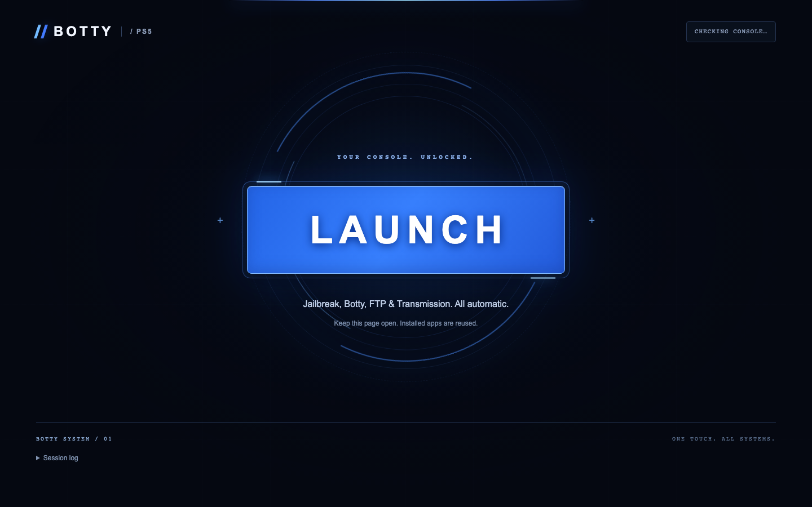

# Botty+ 1.3.8 launch portal

This directory is the customized static Relapse portal. Press **LAUNCH** once on
a supported PS5 browser and keep the page open. The sequence verifies/installs
Botty+, loads Kstuff and ShadowMountPlus, starts FTP on 2121 and prepares
rTorrent and the Botty service. After **READY**, press PS and open **Botty+**.
Home-screen registration is asynchronous. Restart after a failed session.

Release 1.3.8 bundles native 01.003.007, service 1.3.6, rTorrent 0.16.24-botty3
and ShadowMountPlus 1.7beta4-botty.1. Existing Transmission installations need an
explicit migration before rTorrent can start; keep original metadata and downloads.
The separate artwork service must also be updated to obtain the blank-cover fix.

The bundled offset files cover 7.00–13.60. This does not establish full-stack
compatibility across that range. Hardware observations are limited to 13.00.

The full repository includes `README.md`, `deployment/README.md` and
`docs/DEVELOPMENT.md` with hosting, console setup, updates and build instructions:
[Botty+ repository](https://github.com/Portablelle/botty-ps5).

## Portal screenshot

This is the current launch portal shown on a supported PS5 browser. Select
**LAUNCH** to start the setup sequence.

Host the complete verified export at the root of a trusted HTTPS origin. Package
verification requires Web Crypto. The browser fetches payloads and applications
from relative paths; there is no maintainer-hosted domain dependency. Do not
rewrite package contents, cache incompatible releases together or serve local
backup directories. `manifest.json` inventories the exported files.

The installer preserves existing matching files and running services. A recognized older native title is updated with the app closed after staging and
verification, with its previous directory retained in private storage. Foreign
titles and downgrades are refused. Interrupted swaps recover through a journal.
A newer service is staged while an old daemon continues its active work; it starts
on the next console restart. FTP is loaded again after reboot;
successful payload delivery is not proof that a payload initialized correctly.

## Upstream credits

The browser stage uses JavaScriptCore information leaks and a structured-clone
object pool mismatch. The kernel stage combines an address leak with an
`aio_multi_wait` use-after-free race.

- Sonic_Iso: kernel exploit.
- Jordy: WebKit exploit and kernel bug.
- ntfargo and ufm42: exploit development.
- Dr. Yenyen: testing.
- Additional contributors: TheFlow, SlidyBat, Flatz, cow, nhk, bollarz,
  Sleirsgoevy, EchoStretch and EarthOnion.

Upstream revision is recorded in `manifest.json` and in the repository's
`Relapse-Exploit` submodule. Preserve the upstream `LICENSE` and attribution.

The bundled ShadowMountPlus `1.7beta4-botty.1` includes Botty's guarded TitleDir
recovery and pinned ShellCore hooks. Its [notice](payloads/shadowmountplus-NOTICE.md),
[GPL license](payloads/shadowmountplus-LICENSE.txt) and
[complete corresponding source](payloads/shadowmountplus-source.tar.gz)
are included in this portal.

Library compression creates a verified copy and retains the original until the
user explicitly requests its deletion. Close Botty+ when prompted to complete
mount verification. The portal also installs and starts the loopback compression
worker. Existing running services are left alone; staged updates start next session.

Release 1.2.2 authorizes the worker's loopback port 5910 during launch. Retrying
failed or cancelled compression through **Compress game** removes only the
tracked unfinished image and hash sidecar before checking free space and
restarting from zero. The original is kept. Completed images and uncertain
activation/deletion operations remain protected; checkpoint resume is unsupported.

## CheatRunner

LAUNCH also prepares the pinned CheatRunner 0.17.2-botty.1 service on port 9999, with its
original home-screen tile under **Media / Media Players** (CHTR09999). After a
reboot, run LAUNCH before opening the tile. The Portal also exposes **Open
CheatRunner** when the HTTP service is ready. No page is added to Botty+.

Existing running instances and all cheat/patch/profile files are preserved. The
ShellUI hotkey is disabled before a fresh payload start. Startup is deferred while
Botty is extracting, transferring or compressing; a CheatRunner error leaves the
Botty session usable and is displayed in the session log. Tile registration and
HTTP health do not certify launch or cheat compatibility on 13.00/Relapse.

[Upstream provenance and integration notes](apps/cheatrunner/NOTICE.md),
[GPL-3.0 license](apps/cheatrunner/LICENSE),
[published upstream source snapshot](apps/cheatrunner/cheatrunner-source.tar.gz).
The snapshot does not include the upstream embedded tile's missing build recipe.

## Content verification policy

Extra completion rehash, cross-disk full comparison and automatic post-compression
comparison are disabled. Piece validation, RAR CRC, completed writes/fsync, file
sizes and mount checks remain. Compressed copies are ready but **Not verified**;
the original is retained. The service web UI offers an explicit full comparison
and a cooperative skip. A copied compressed image loses any prior verified flag.
